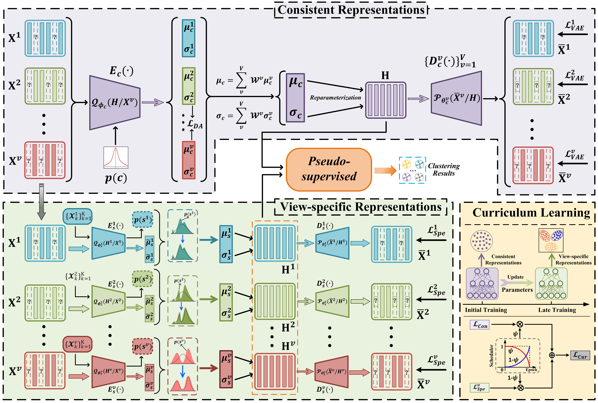

The demo code of Curriculum learning: Efficient Multi-view Representations for Incomplete Multi-view Clustering with Pseudo-supervised.

We present an overview of ROSE below. It comprises three joint learning components: consistent representation learning, which aims to fully capture cross-view consistent information; and view-specific representation learning, which emphasizes view-specific discriminative information. Additionally, to leverage the consistent and complementary information from these two components, curriculum learning guides the entire model to first learn consistent representations, then progressively focus on view-specific ones. Finally, the pseudo-supervised module encourages each view to retain its specific information while learning cross-view consistent information.

## Abstract

The rapid advancement of multi-view representation learning has spurred breakthroughs in incomplete multi-view clustering (IMC). Despite progress, prevailing multi-view representation learning methods often apply a uniform strategy to capture both consistent and view-specific information simultaneously, overlooking the inherent tendency of neural networks to prioritize cross-view consensus before gradually memorizing view-specific details. This mismatch leads to suboptimal representation quality in IMC tasks. To overcome this, we propose ROSE, an efficient multi-view representation framework that leverages a curriculum learning strategy to first guide the model toward learning cross-view consistent representations and then progressively shift focus to view-specific features, aligning the learning process with the natural behavior of neural networks. Moreover, each view is equipped with a learnable prior, enabling view-specific representations to adapt to their optimal distributions rather than being constrained by a predefined structure. Additionally, a pseudo-supervised clustering module integrates global pseudo-labels to align view-specific soft assignments, reducing cross-view discrepancies and enabling end-to-end clustering without post-processing. Extensive experiments on multiple multi-view datasets demonstrate that ROSE consistently outperforms baseline IMC methods across various metrics and missing rates.
